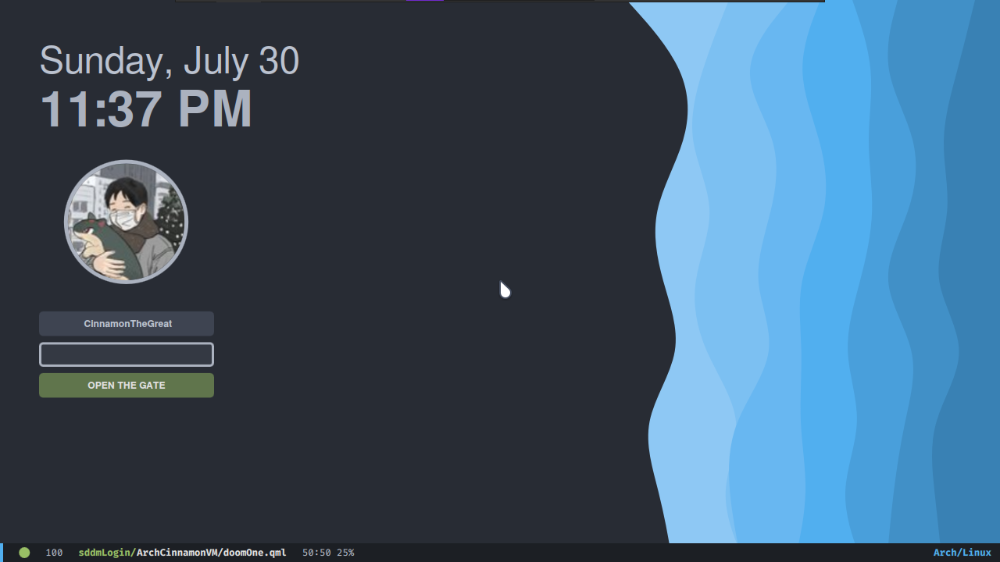
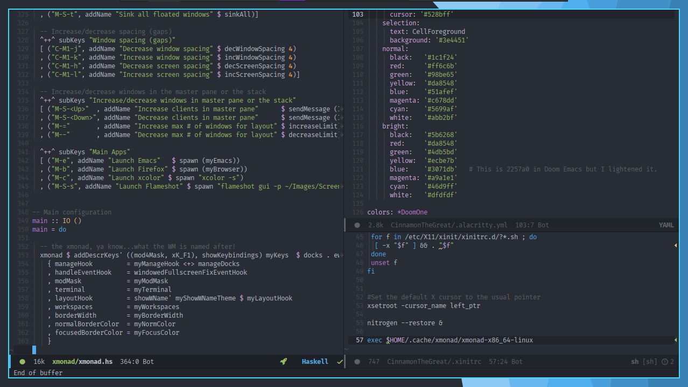

# sddm doomemacs

[SDDM](https://github.com/sddm/sddm), but looking like the doom emacs editor.

By now the color palet is the same as doom-emacs doomone.




Forked from aczw corners theme.
.

## dependencies
Tested on Arch-linux in wich sddm installs with the needed qt libraries, so if you want to try on another distro consult your documentation.

- SDDM
- Qt Graphical Effects
- Qt SVG
- Qt Quick Controls 2

on Arch, run `pacman -Syu sddm qt5-graphicaleffects qt5-svg qt5-quickcontrols2`

## installation
Unfortunally only available for manual installation, don't forget this project is still in development.

Download/clone this repo, and copy the `doomemacs/` folder to `/usr/share/sddm/themes/`.

```
gh repo clone https://github.com/JulioEPdS/sddm-doomemacs-theme
cd sddm-doomemacs-theme
cp -r doomemacs/ /usr/share/sddm/themes/
```

## configuration
A little pallete colors, font and distribution of the elements can be tweaked via the `theme.conf` file (inside `doomemacs/` folder).

Please see [CONFIG.md](CONFIG.md) for a short description of what each option does

If you haven't already, make sure to change the current theme that SDDM is using. on Arch, create a config file in `/etc/sddm.conf.d/` with the following contents:

```
[Theme]
Current=doomemacs
```

Check the [Arch Wiki](https://wiki.archlinux.org/title/SDDM#Configuration) for more info.

## license

This project is licensed under GPLv3. check it out [here](LICENSE).
